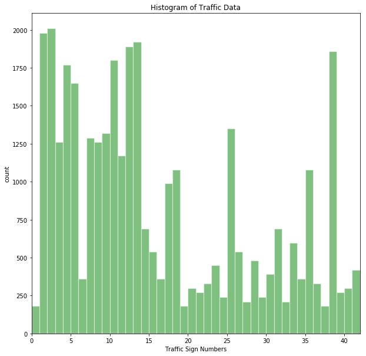

# **Traffic Sign Recognition** 

## **Traffic Sign Recognition Project**

The goals / steps of this project are the following:
* Load the data set (see below for links to the project data set)
* Explore, summarize and visualize the data set
* Design, train and test a model architecture
* Use the model to make predictions on new images
* Analyze the softmax probabilities of the new images
* Summarize the results with a written report

[//]: # (Image References)

[image1]: ./Output/visualization.png 
[image2]: ./Output/data_augmentation.png "Data Statistics after data augmentation"
[image3]: ./Output/before_after.png "Before and After GrayScaling"
[image4]: ./Output/new_images.png "Traffic Signs"
[image5]: ./examples/placeholder.png "Traffic Sign 2"
[image6]: ./examples/placeholder.png "Traffic Sign 3"
[image7]: ./examples/placeholder.png "Traffic Sign 4"
[image8]: ./examples/placeholder.png "Traffic Sign 5"

---
### Writeup / README

You're reading it! and here is a link to my [project code](https://github.com/rakeshakkineni/P2_Traffic_Sign_Classifier/P2_Traffic_Sign_Classifier.ipynb)

### Data Set Summary & Exploration

#### 1. Provide a basic summary of the data set. In the code, the analysis should be done using python, numpy and/or pandas methods rather than hardcoding results manually.

I used the python library to calculate summary statistics of the traffic signs training data set following are the results before any modifications:

* The size of training set is ?
  Number of training examples = 34799
  
* The size of the validation set is ?
  Number of validation examples = 4410
  
* The size of test set is ?
  Number of testing examples = 12630
  
* The shape of a traffic sign image is ?
  Image data shape = [32, 32]
   
* The number of unique classes/labels in the data set is ?
  Number of classes = 43

#### 2. Include an exploratory visualization of the dataset.

Here is an exploratory visualization of the data set. It is a bar chart showing how the training set data is distriuted. As it can be seen the data is not uniform and is distributed unevenly and there are many traffic signs that donot have more than 200 train images.

                                        __**Raw Data Statistics**__

### Design and Test a Model Architecture ###

#### 1. Describe how you preprocessed the image data. What techniques were chosen and why did you choose these techniques? Consider including images showing the output of each preprocessing technique. Pre-processing refers to techniques such as converting to grayscale, normalization, etc. (OPTIONAL: As described in the "Stand Out Suggestions" part of the rubric, if you generated additional data for training, describe why you decided to generate additional data, how you generated the data, and provide example images of the additional data. Then describe the characteristics of the augmented training set like number of images in the set, number of images for each class, etc.)

#### - Data Augmentation: ####
  From above question we can see that training data is not uniformly distributed. Initially i used the given data but the model could not even achieve 92% accuracy. Hence i have decided to increase the size of the training data. I followed following technique.
 
 Identify all the traffic signs which have less 1500 train data. Collect all similar traffic sign images and lables that fall in this category in buffers. Pass the extracted data to a function "expand_training_data". 
 
 expand_training_data function shall take one image at a time and shall
    -  randomly rotate by +/-5 degrees 
    -  randomly change the brightness of the image.
 this function shall  continue this operation on the images untill total image (orignal data + new data ) size is around 1500 per traffic sign. 
 
 The function "expand_training_data" shall return the new images and the new images are appened to the old image data set. Following image shows the result of Data Augmentation. It can be seen that after augmenting the data set has better uniformity.
 
![image2]

#### - GrayScaling and Normalization: ####
  After augmenting the data set ,all images are converted to grayscale and then normalized. I normalized the image data because it was easy to process 32x32x1 image than 32x32x3. Here is an example of a traffic sign image before and after grayscaling.

![image3]

#### 2. Describe what your final model architecture looks like including model type, layers, layer sizes, connectivity, etc.) Consider including a diagram and/or table describing the final model.

My final model consisted of the following layers:

| Layer         		|     Description	        					| 
|:---------------------:|:---------------------------------------------:| 
| Input         		| 32x32x1 RGB image   							| 
| Convolution 5x5     	| 1x1 stride, valid padding, outputs 28x28x16 	|
| SELU					|												|
| Max pooling	      	| 2x2 stride,  outputs 14x14x16 				|
| Convolution 5x5	    | 1x1 stride, valid padding, outputs 10x10x32 	|
| SELU					|												|
| Max pooling	      	| 2x2 stride,  outputs 5x5x32 				|
| Convolution 2x2	    | 1x1 stride, valid padding, outputs 4x4x64 	|
| SELU					|												|
| Max pooling	      	| 2x2 stride,  outputs 2x2x64 				|
| Fully connected		| input 256, output 128       									|
| SELU					|												|
| Fully connected		| input 84, output 128        									|
| SELU					|												|
| DROPOUT					|						0.9						|
| Fully connected		| input 43, output 128         									|
| Softmax				|      									|
|	reduce_mean					|												|
|	AdamOptimizer					|												|
|	minimizer					|												|

#### 3. Describe how you trained your model. The discussion can include the type of optimizer, the batch size, number of epochs and any hyperparameters such as learning rate. ####

To train the model, I used above mentioned model. The training data provided by UdaCity is augmented to have atleast 1500 images per traffic signs , using data augmentation Train Data Set was increased from 34799 to 79347 samples.

Following are the settings for hyperparameters
  - Batch Size : 256
  - EPOCHS : 100
  - Learning Rate : 0.002

#### Choosing Maximum Accuracy: ####  
It was observed that the accuracy of the model oscillating , so it is not neccassary that the last EPOCH has the maximum  accuracy. To ensure that model uses the maximum accuracy the accuracy after every EPOCH is stored in an array and if the new accuracy is maximum value till now then all the variables at the checkpoints were saved using tf.train.Saver tensor. By default tf.train.Saver tensor can store a maximum of 5 checkpoints variables , so at the end of training we will end up with 5 sets of variable data and the last saved variables correspond to the maximum accuracy. For testing the model last saved variables are restored as they correspond to maximum validation accuracy.

#### 4. Describe the approach taken for finding a solution and getting the validation set accuracy to be at least 0.93. Include in the discussion the results on the training, validation and test sets and where in the code these were calculated. Your approach may have been an iterative process, in which case, outline the steps you took to get to the final solution and why you chose those steps. Perhaps your solution involved an already well known implementation or architecture. In this case, discuss why you think the architecture is suitable for the current problem.

My final model results were:
* training set accuracy of ?
* validation set accuracy of ? 
* test set accuracy of ?

If an iterative approach was chosen:
* What was the first architecture that was tried and why was it chosen?
  I started with LeNet that was suggested in ReadMe.md of UdaCity Project ,i have just changed the layer to generate 43 labels instead of 10. With this approach i could at the maximum get 90% of accuracy.
  
* What were some problems with the initial architecture?
  In the initial architecture i faced following issues.
  - Learning Rate was a bit slow 
  - Peak achievable accuracy was just 90%
  - Does not have dropout layer thus there was a chance of overfitting if the number of EPOCHs were increased.
* How was the architecture adjusted and why was it adjusted? Typical adjustments could include choosing a different model architecture, adding or taking away layers (pooling, dropout, convolution, etc), using an activation function or changing the activation function. One common justification for adjusting an architecture would be due to overfitting or underfitting. A high accuracy on the training set but low accuracy on the validation set indicates over fitting; a low accuracy on both sets indicates under fitting.
  I have tried many architectures to increase the accuracy. Following changes were done to the inital architecture. 
  
  #### Model Architecture: ####
  - ###### DropOut:###### 
    I started with Dropout after every layer (Convolution and Full Connected) but this has reduced the accuracy to 87%. Then applied Dropout only to Fully Connected Layers even this apporached affected the accuracy. So  finally decided to use dropout on last but one Fully Connected Layers.
  - ###### No of Convolution Layers:###### 
    Initial architecture was reducing the dataset size from 32 x 32 x 1 to 32 x 32 x 6 and at the maximum 16 layers by the end of second Convolution Layers. We have to recognize 43 traffic signs,i wanted to ensure that the number of filters on last Convolution Layer is more than 43. It was difficult to achieve this value without adding a thrid layer. I have changed the number of filters on first and second Convolution Layers too. Following configuration was used in the final model. This decision really helped  in increasing the accuracy. 
    First Convolution Layer: 32X32x1 --> 28x28x16
    Second Convolution Layer: 14x14x16 --> 10x10x32
    Third Convolution Layer: 5x5x32 --> 4x4x64
   After adding third layer i was able to get accuracies more than 94%
  - ###### Activation Function: ######
     I have changed the activation fucntion from RELU to SELU as this move helped in getting validation accuracy of >90% with in first 5 EPOCHs. And this was a new activation function i wanted to try out the behavior of this function. 
  - ###### Fully Connected Layer ######
     I have an additional Fully Connected Layer increase the accuracy. I could see an increase of 1% after adding the additional Fully Connected Layer.  
  
* Which parameters were tuned? How were they adjusted and why?
  #### HyperParameters: ####
  - Learning Rate: Changed learning rate from 0.001 to  0.002. This helped in reaching the >90% in first 10 EPOCHs.
  - Batch Size : Had changed the batch size from 128 to 256 to fasten the training.
  - EPOCHs : Had tried many combinations of this hyperparmeter. Ex: 60 , 100, 200. In the end choose 100 as after this value i did not see a lot of change in the accuracy, besides i was training the model on my laptop it took 5 hours to complete the training with 100 EPOCHs and 7 hours for 200 EPOCHs. I do not have patience more than 5 hours :).
  - Size of Training DataSet : I have decided to increase the size of Training DataSet as i could not achieve more than 93% accuracy using the original Training DataSet. I have changed the size to 100K but it took a lot of time to train and accuracy was around 97% , to same the time i have reduced the DataSet size to 70K this gave optimal results. 
  
* What are some of the important design choices and why were they chosen? For example, why might a convolution layer work well with this problem? How might a dropout layer help with creating a successful model?
  Most important design choice was to increase Training DataSet and adding additional convolution layer. Convolution Layer works well for classification. I chose to add dropout to  avoid over fitting.
  
If a well known architecture was chosen:
* What architecture was chosen?
  LeNet with some changes
* Why did you believe it would be relevant to the traffic sign application?
  LeNet helps in classifying the features.  
* How does the final model's accuracy on the training, validation and test set provide evidence that the model is working well?
  It was possible to achieve 100% Test accuracy with this model, even though the training data set was not huge the model was able to 100% Test accuracy which is evident that the choosen model is right.

### Test a Model on New Images ###

#### 1. Choose five German traffic signs found on the web and provide them in the report. For each image, discuss what quality or qualities might be difficult to classify. ####

Here are five German traffic signs that I found on the web:

![image4] 

I think 7th and 8th images are toughest to classify as these images have comparitively more than other images.

#### 2. Discuss the model's predictions on these new traffic signs and compare the results to predicting on the test set. At a minimum, discuss what the predictions were, the accuracy on these new predictions, and compare the accuracy to the accuracy on the test set (OPTIONAL: Discuss the results in more detail as described in the "Stand Out Suggestions" part of the rubric). ####

Here are the results of the prediction:

| Image			        |     Prediction	        					| 
|:---------------------:|:---------------------------------------------:| 
| Stop Sign      		| Stop sign   									| 
| U-turn     			| U-turn 										|
| Yield					| Yield											|
| 100 km/h	      		| Bumpy Road					 				|
| Slippery Road			| Slippery Road      							|

The model was able to correctly guess 4 of the 5 traffic signs, which gives an accuracy of 80%. This compares favorably to the accuracy on the test set of ...

#### 3. Describe how certain the model is when predicting on each of the five new images by looking at the softmax probabilities for each prediction. Provide the top 5 softmax probabilities for each image along with the sign type of each probability. (OPTIONAL: as described in the "Stand Out Suggestions" part of the rubric, visualizations can also be provided such as bar charts)

The code for making predictions on my final model is located in the 11th cell of the Ipython notebook.

For the first image, the model is relatively sure that this is a stop sign (probability of 0.6), and the image does contain a stop sign. The top five soft max probabilities were

| Probability         	|     Prediction	        					| 
|:---------------------:|:---------------------------------------------:| 
| .60         			| Stop sign   									| 
| .20     				| U-turn 										|
| .05					| Yield											|
| .04	      			| Bumpy Road					 				|
| .01				    | Slippery Road      							|

For the second image ... 

### (Optional) Visualizing the Neural Network (See Step 4 of the Ipython notebook for more details)
#### 1. Discuss the visual output of your trained network's feature maps. What characteristics did the neural network use to make classifications?

